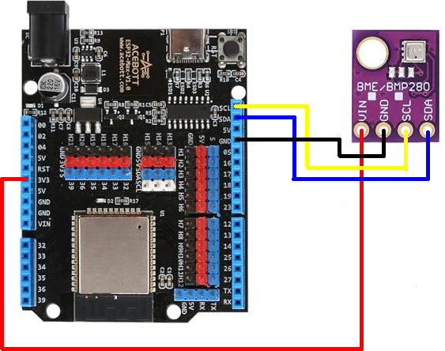

# BME280 Sensor Integration

This document outlines the physical wiring and ESPHome configuration for integrating a BME280 sensor into the Campernet system. 

---

## 📷 Wiring Diagram

## BME280 Wiring — Acebott ESP32 (Pre-Jackery Test)

This wiring reflects the sensor setup before it was disconnected for BLE impersonation testing. Note the non-standard wire colors and duplication.

### ESP32 Side (Acebott Board)

| Wire Color | ESP32 Pin | Function |
|------------|-----------|----------|
| Yellow     | SDA       | Data line (I2C) |
| Blue       | SCL       | Clock line (I2C) |
| Blue       | SDA       | Duplicate wire (possibly misrouted or reused) |
| Black      | GND       | Ground |
| Red        | 3V3       | Power |

### BME280 Sensor Side

| Wire Color | Sensor Pin | Function |
|------------|------------|----------|
| Blue       | SDA        | Data line |
| Yellow     | SCL        | Clock line |
| Black      | GND        | Ground |
| Red        | VIN        | Power input (matches 3V3 from ESP32) |

## 📐 Sensor Capabilities

The BME280 is a compact environmental sensor combining temperature, humidity, and barometric pressure sensing. Key specs:

- **Package**: 2.5 × 2.5 × 0.93 mm metal-lid LGA
- **Interfaces**: I²C and SPI (Campernet uses I²C)
- **Supply voltage**:
  - Sensor: 1.71–3.6 V
  - Interface: 1.2–3.6 V
- **Power consumption**:
  - Active: ~3.6 µA (1Hz mode)
  - Sleep: 0.1 µA
- **Humidity**:
  - Range: 0–100% RH (non-condensing)
  - Accuracy: ±3% RH typical
  - Response time: ~1s
- **Pressure**:
  - Range: 300–1100 hPa
  - Accuracy: ±1 hPa typical
  - Resolution: 0.18 Pa
- **Temperature**:
  - Range: -40 to +85°C
  - Accuracy: ±1°C typical
  - Resolution: 0.01°C

The temperature reading is also used internally to compensate humidity and pressure values. Oversampling and filtering options allow tuning for noise, response time, and power draw.